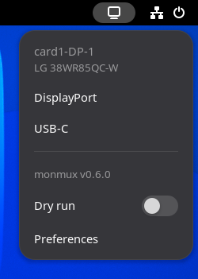
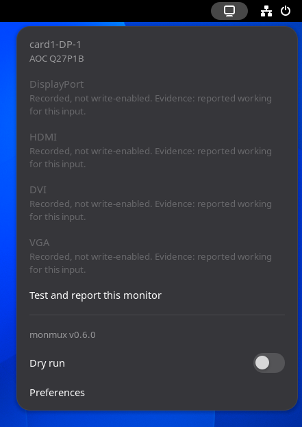

# monmux — GNOME Shell extension

Switch a supported monitor between its video inputs from the GNOME top panel.

<p>
  
  &nbsp;
  
</p>

The panel menu lists the attached displays and, under each one, the inputs that [`monmux`](https://github.com/leinardi/monmux)
will actually write. Pick one and `monmux` switches the monitor. An input `monmux` knows about but has not enabled is shown
greyed out, with the reason, so the menu says *why* something is unavailable instead of hiding it.

`monmux` is a separate command-line tool, and it takes every decision. It identifies each attached monitor against a built-in
catalog of models, and refuses anything it cannot positively identify or that the catalog does not explicitly enable for that
model. This extension runs it, renders what it reports, and tells you what it answered. It can enable nothing `monmux` refuses.

The screenshots come from a nested GNOME Shell running against this repository's fake `monmux`, so no real monitor's serial
number can appear in them.

## Status

**In development.** It works in a nested GNOME Shell against a fake `monmux`, and has not yet been run against a real monitor:
that is the checklist in [docs/testing.md](docs/testing.md). There is no release yet, and it is not on extensions.gnome.org —
both come later. Until then, it is installed from source.

The Italian translation is a first draft awaiting review.

## Requirements

- GNOME Shell 46, 47, 48, 49 or 50
- [`monmux`](https://github.com/leinardi/monmux) 0.6.0 or newer, or a local `make go-build` of it, installed and working from
  a terminal: start with `monmux doctor`
- a monitor `monmux` supports. It supports few, on purpose: an input is write-enabled only after somebody with that monitor
  in front of them switched it and wrote down what happened.

## Install from source

Building needs `git`, `make`, Node.js with `npm`, and `gettext`, which compiles the translations into the zip:
`sudo apt install gettext` on Debian or Ubuntu, `sudo dnf install gettext` on Fedora.

```sh
git clone https://github.com/leinardi/gnome-shell-extension-monmux.git
cd gnome-shell-extension-monmux
make ext-deps          # npm ci
make ext-pack          # dist/monmux@leinardi.github.io.shell-extension.zip
make ext-install
```

GNOME Shell only picks up a new extension after a restart: on Wayland, log out and back in; on X11, press <kbd>Alt</kbd> +
<kbd>F2</kbd> and type `r`. Then:

```sh
gnome-extensions enable monmux@leinardi.github.io
```

To remove it: `gnome-extensions uninstall monmux@leinardi.github.io`.

## Using it

### The menu

The menu reads the displays each time it opens, and again about a second after a monitor is plugged in or unplugged. Each
display is a section: its connector, such as `card1-DP-1`, its model, and its inputs. Click an input to switch to it. While a
switch runs, the inputs cannot be clicked.

There is no "current input" marker, and there will not be one: `monmux` never asks a monitor which input it is on, so the
extension has nothing truthful to show.

Below the displays:

- **monmux vX.Y.Z** — the version that answered.
- **Dry run** — while it is on, a click or a shortcut has `monmux` print the command it would run, and nothing is sent to the
  monitor.
- **Preferences** — the shortcuts, serial targeting, and diagnostics.

### Notifications

Every switch ends in one notification, and it says exactly what `monmux` said:

| Title | What it means |
| --- | --- |
| Input-switch command sent | `monmux` sent the command. Nothing reads the input back, so the notification does not claim the monitor changed. |
| Dry run | The command `monmux` would have run. Nothing was sent. |
| monmux refused | `monmux` declined, for the reason shown. "No DDC write was performed." **Troubleshooting** opens the section for that reason. |
| monmux failed | `monmux` ran and failed, or could not be run, or wrote something that could not be read. "The write status is unknown." Look at the monitor. |
| monmux gave an unexpected answer | An answer outside `monmux`'s documented format. The write status is unknown. **Report this** opens an issue here. |
| monmux is too old | The `monmux` on `PATH` was replaced by one older than 0.6.0. The write status is unknown. |

Only a refusal says that nothing was written.

### Keyboard shortcuts

There are four slots, each a shortcut and the input it switches to. Set them on the **Shortcuts** page of the preferences:
the dropdown lists every input name in `monmux`'s catalog, and the shortcut button asks for a key combination with Ctrl, Alt or
Super in it. If GNOME asks whether the window may capture shortcuts, allow it: otherwise pressing a combination that is
already set runs that shortcut instead of capturing it.

The same keys can be set with `gsettings`, pointing it at the schema the extension installed:

```sh
SCHEMAS=~/.local/share/gnome-shell/extensions/monmux@leinardi.github.io/schemas
gsettings --schemadir "$SCHEMAS" set org.gnome.shell.extensions.monmux shortcut-1 "['<Super><Alt>1']"
gsettings --schemadir "$SCHEMAS" set org.gnome.shell.extensions.monmux shortcut-1-input 'dp'
```

- The input is named the way `monmux` names it, such as `dp`. Which display it belongs to is `monmux`'s decision, as for a
  click in the menu, so the dropdown offers every name the catalog records, not only the ones the attached monitor accepts.
- A shortcut goes the way a click goes: **Dry run** applies to it, it is ignored while another switch runs, and its
  notification says the same things.
- A shortcut names an input, not a display, so serial targeting never pins it. With two or more supported monitors attached,
  `monmux` refuses it with `multiple-candidates`, unless a `serial:` pin in its configuration file picks one.
- A slot with a shortcut and no input, or with a value that is not an input name, starts nothing and says so.
- Shortcuts work on the desktop, not in the overview or on the lock screen.

### Serial targeting

With two or more supported monitors attached, `monmux` will not pick one on its own, so a click ends in a
`multiple-candidates` refusal. Turn on **Serial targeting** on the **Shortcuts** page of the preferences, and the menu reads
the monitors' serial numbers with `monmux info --show-serial`, so that a click is pinned to the monitor it was made under with
`monmux switch … --serial`.

- It is off by default, and while it is off `--show-serial` is never passed.
- The serials are kept in memory to pin a click. They are never shown in the menu, in a notification or in the log.
- A monitor with no readable serial is left unpinned. Without a `serial:` pin in `monmux`'s configuration file, `monmux` then
  refuses that click as it would without the setting; with one, the click goes to the pinned monitor, which may not be the one
  it was made under.
- `--serial` wins over that `serial:` pin. A pinned click targets the monitor it was made under, whatever the file says; an
  unpinned click — one supported monitor, a monitor with no readable serial, or the setting off — leaves the file's pin in
  force.

**Not hardware-verified.** It has only been exercised against the fake `monmux`, and it stays marked that way until somebody
with two supported monitors has tried it.

### Diagnostics

The **Diagnostics** page of the preferences shows where `monmux` was found on `PATH` and the version it reports, and runs
`monmux doctor` on request, with a button to copy what it printed into a report. It only reads: the preferences window
cannot start a switch.

## Why something is greyed out

The menu shows what `monmux` reported, and the words below are what it says. Where a line is `monmux`'s own — a check's name
and detail, or what it printed — it is shown as `monmux` wrote it, untranslated.

### An input

| The menu says | What it means | What to do |
| --- | --- | --- |
| Recorded, not write-enabled. Evidence: … | The catalog records this input for the model, but `monmux` has not enabled it, so it will not write it. The evidence says how strong the record is: *tested directly on this model*, *from the manufacturer's documentation*, *reported working for this input*, or *quoted in a report, inputs not tried one by one*. | **Test and report this monitor** opens [adding a monitor](https://github.com/leinardi/monmux/blob/main/docs/adding-a-monitor.md). |
| monmux gave an answer that does not follow its documented format. | `monmux` enabled an input its catalog does not record, or recorded one without a label or an evidence grade. Nothing about it is guessed. | [Report it](https://github.com/leinardi/gnome-shell-extension-monmux/issues). |

### A display

A greyed display offers none of its inputs.

| The menu says | What it means | What to do |
| --- | --- | --- |
| Not in the monmux catalog. | The display can be reached and written to, but no catalog entry matches it. | **Test and report this monitor** opens [adding a monitor](https://github.com/leinardi/monmux/blob/main/docs/adding-a-monitor.md). |
| More than one catalog entry claims this monitor. | The catalog matches it more than once, and `monmux` does not guess between them. | [Troubleshooting](https://github.com/leinardi/monmux/blob/main/docs/troubleshooting.md#ambiguous-catalog). |
| This display cannot be written to. | The backend reports that it cannot write to this display. | [Troubleshooting](https://github.com/leinardi/monmux/blob/main/docs/troubleshooting.md#display-not-writable), and `monmux doctor`. |
| This display exposes no DDC channel. | The backend found no DDC channel to talk to the display over. | `monmux doctor`, and the [troubleshooting guide](https://github.com/leinardi/monmux/blob/main/docs/troubleshooting.md). |
| This display's EDID could not be read. | The display's identity could not be read, so it cannot be matched against the catalog. | `monmux doctor`, and the [troubleshooting guide](https://github.com/leinardi/monmux/blob/main/docs/troubleshooting.md). |
| This display has no UUID to address it by. | The backend reported no identifier to address the display by. | `monmux doctor`, and the [troubleshooting guide](https://github.com/leinardi/monmux/blob/main/docs/troubleshooting.md). |
| monmux gave an answer that does not follow its documented format. | Two of `monmux`'s answers disagree about this display — inputs enabled on a display it would not write to, or a model its catalog lists no times or twice — or the entry is missing a field. | [Report it](https://github.com/leinardi/gnome-shell-extension-monmux/issues). |
| a code, such as `some-new-status` | A value from a newer `monmux` than this extension knows. | Update the extension. |

### The whole menu

| The menu says | What it means | What to do |
| --- | --- | --- |
| monmux is not installed. | There is no `monmux` on `PATH`. | **How to install monmux** opens [its install section](https://github.com/leinardi/monmux/blob/main/README.md#install). |
| The installed monmux is too old for this extension, which needs version 0.6.0 or newer. | The `monmux` on `PATH` predates the JSON contract this extension reads. | **How to install monmux**. |
| The installed monmux could not be identified. | It answered `version --json`, but not with a version this extension could read. What it printed is shown under it. | Run `monmux version` in a terminal. |
| monmux refused while reading the displays. | `info` declined — usually a failing check, listed below it — and still reported the displays. | The failing checks, and **Troubleshooting**. |
| monmux failed while reading the displays. | `info` failed. What it printed is shown under it. | `monmux doctor`. |
| monmux failed while reading its catalog. | `catalog list` failed. The displays cannot be labelled. | `monmux catalog list` in a terminal. |
| *name*: *detail*, then **Troubleshooting** | One of `monmux`'s checks did not pass, in its own words. | **Troubleshooting** opens the [troubleshooting guide](https://github.com/leinardi/monmux/blob/main/docs/troubleshooting.md). |
| The serial numbers could not be read, so a click cannot be pinned to one display. | Serial targeting is on, and reading the serials failed. Clicks go unpinned, and `monmux` decides. | `monmux info --show-serial` in a terminal. |
| No display was detected. | `monmux` answered cleanly and reported no display. | `monmux doctor`. |
| monmux could not be run, or what it wrote could not be read. | The process did not start, or its output was not valid text. | Run `monmux version` in a terminal. |

## Links

- [`monmux`](https://github.com/leinardi/monmux), and [how to install it](https://github.com/leinardi/monmux/blob/main/README.md#install)
- [Troubleshooting](https://github.com/leinardi/monmux/blob/main/docs/troubleshooting.md), with a section per refusal reason
- [Adding a monitor](https://github.com/leinardi/monmux/blob/main/docs/adding-a-monitor.md): the supported-monitor catalog lives
  in `monmux`, and this is how a model gets into it
- [Issues](https://github.com/leinardi/gnome-shell-extension-monmux/issues) for this extension
- [docs/architecture.md](docs/architecture.md): the model, the client and the lifecycle
- [docs/testing.md](docs/testing.md): how nothing automated reaches a monitor, and the human checklist

## Contributing

[CONTRIBUTING.md](CONTRIBUTING.md). One rule stands out and is absolute: **no AI agent switches a monitor** — not by running
`monmux switch`, and not by clicking an input in a Shell that can reach the real binary. Only a human does that, by hand. The
test suite and `make ext-nested` see a fake `monmux` and nothing else — [docs/testing.md](docs/testing.md).

## Licence

GPL-2.0-or-later. See [LICENSE](LICENSE).
